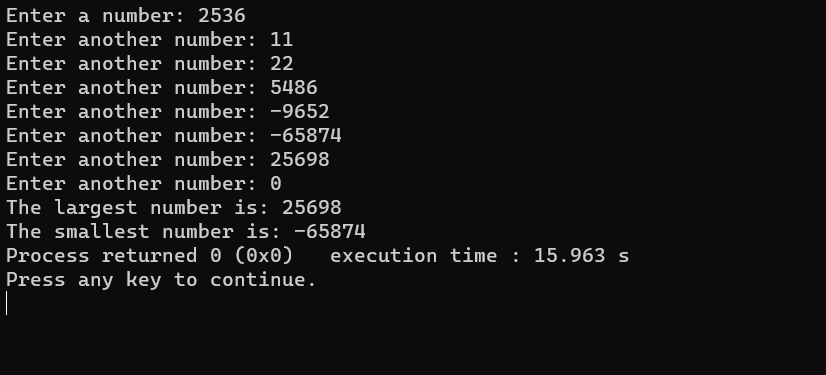

# Largest and Smallest Numbers



## Introduction

Welcome to the "Largest and Smallest Numbers" program! This C++ application is designed to help you find the largest and smallest numbers from a series of user inputs. The program continues to accept numbers until the user inputs 0, at which point it displays the largest and smallest numbers.

## Features

- **Efficient Algorithm**: Quickly identifies the largest and smallest numbers from a series of user inputs.

- **Interactive Interface**: The program provides a user-friendly command-line interface for easy interaction.

- **Educational Tool**: Ideal for learning, teaching, and quick number analysis.

## Demo

Here's a glimpse of the program in action:


## Installation

To run the program, follow these steps:

1. Clone this repository:
   ```shell
   git clone https://github.com/iMamoonAkhter/Largest_Smallest_Numbers.git
